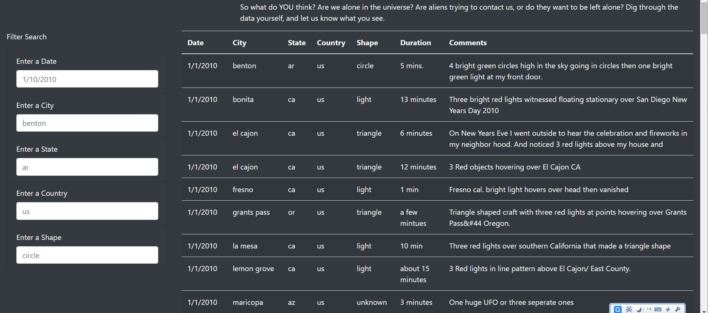
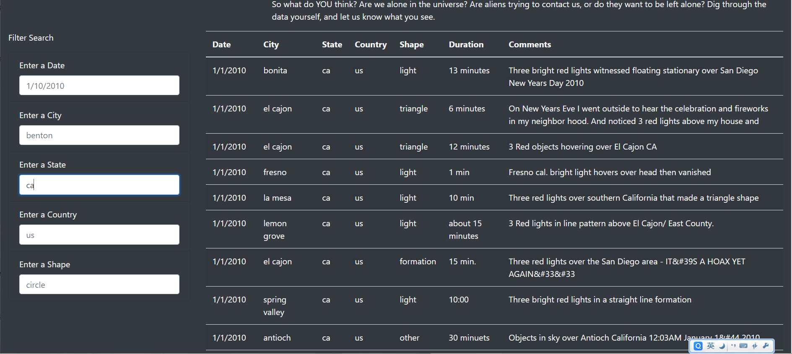
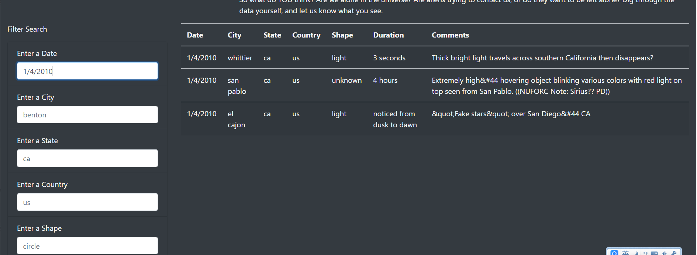
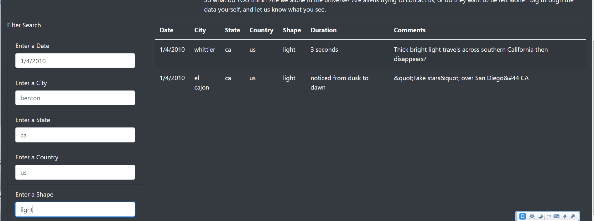

# UFOs

## Overview
After we can filter the data from table by only the date time, we have added more filters for users to filter out the data by serveral conditions simultaneously. The users can have view of the oirgin table once the input text is cleared. The website is more user-friednly after we have added these features.

## Results
|Original table                         |
|          :----------:                 |
|           |

|Filtered by state "ca"                 |
|          :----------:                 |
|           |

|Filtered by date "1/4/2010"(and "ca")  |
|          :----------:                 |
|           |

|Filtered by shape "light"("ca" and "1/4/2010")|
|          :----------:                 |
|           |

End users can easily use this filter feature on our website. I will walk you through the easy steps for filtering out data you want. First of all, the original table is showed up as there is no filter conditions entered. Next, we can enter "ca" in state filter to see only infomation of CA state. You can find that all the cities showed up on table are from CA as shown in the second picture. As we entered date time condition "1/4/2010" to the date filter with previous filter condition "ca", we are telling the website to show only the city infomation of CA and on the date of "1/4/2010".Noted that there are only three results matched both filter conditions as shown in the third picture. Lastly, we would add one more filter condition " light" for the shape condition, there are only two cities, Whittier and El Cajon meet all the filtered conditions: "1/4/2010" for date, "ca" for state and "light" for shape. If you would like to withdraw any condition filters, just simply delete the text in the input box.

## Summary
When users entering the filtering condition, there is possible for them to enter a typo. In this case, our system would not be able to handl that. If "cc" is entered in state filter instead of "ca", there is no mathcing results in the table and nothing would show up. We could adjust our code to accept the ambiguous input from the users.

For further development, we could add two more features on our wesite. The first one would be saving the filtered condition entered before. If the users entered "ca" for the state, after he removed "ca" from the fitler, "ca" would show up as one option if the user reclicks on thestate fitler so that the users do not need to re-enter the same information they entered before. Like you do not need to re-enter your address in Amazon for your orders. The second feature I would like to add is the option to export filtered data as words or PDF. After the users entered the filter conditions, they can easily download or export the result by one click, they could use it for future reference.
